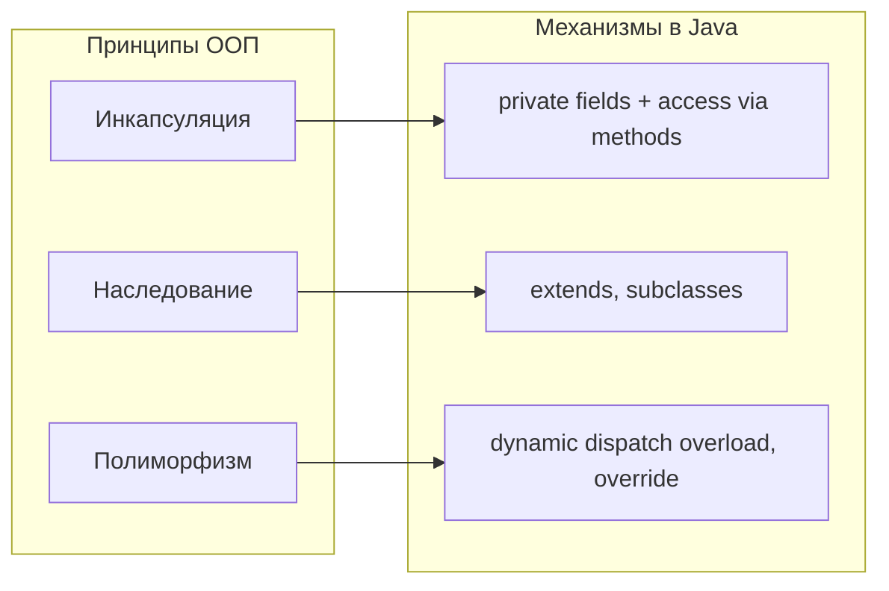
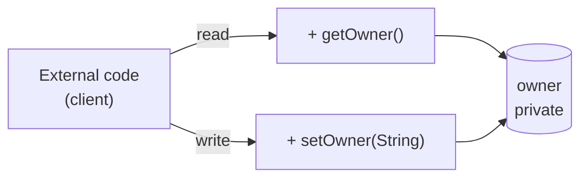
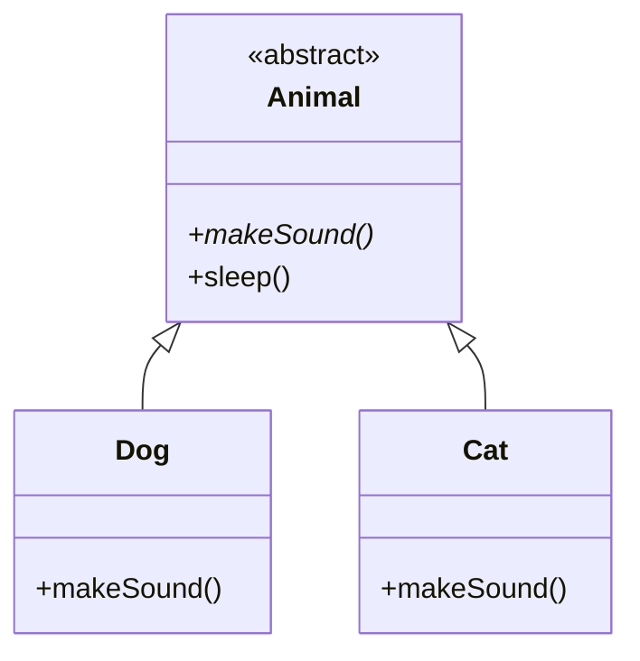
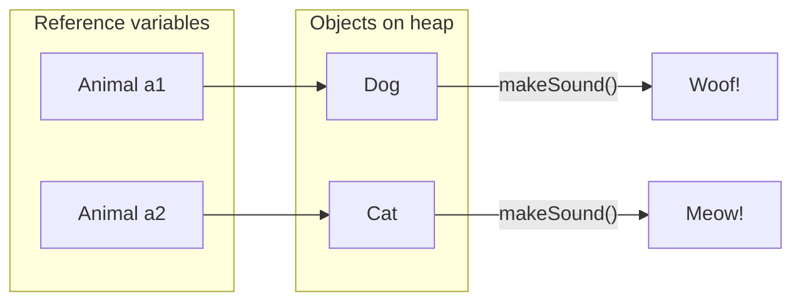
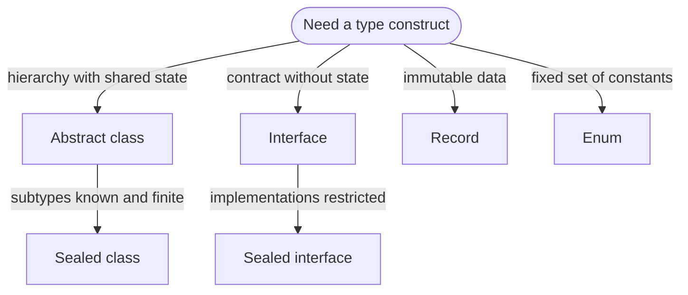
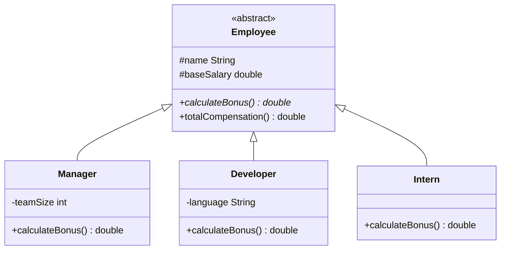
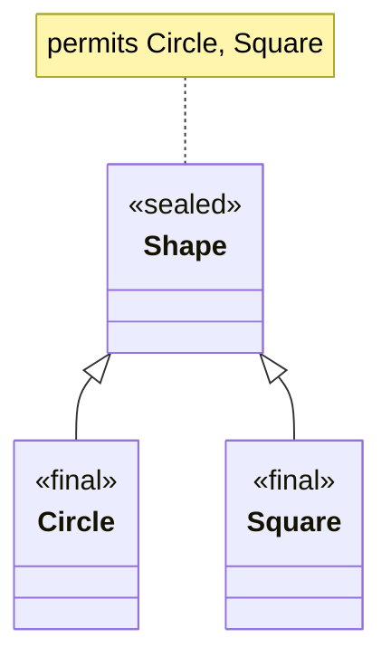
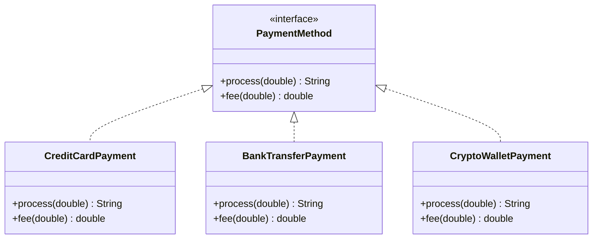
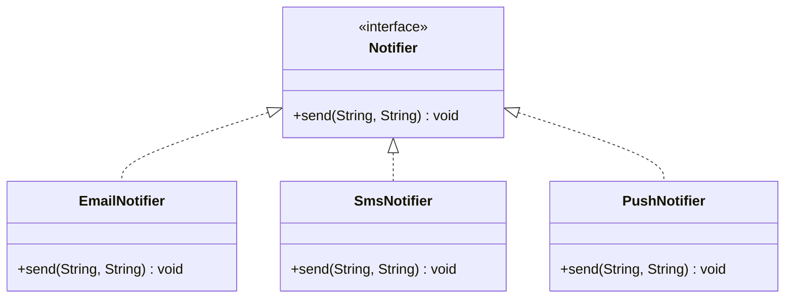
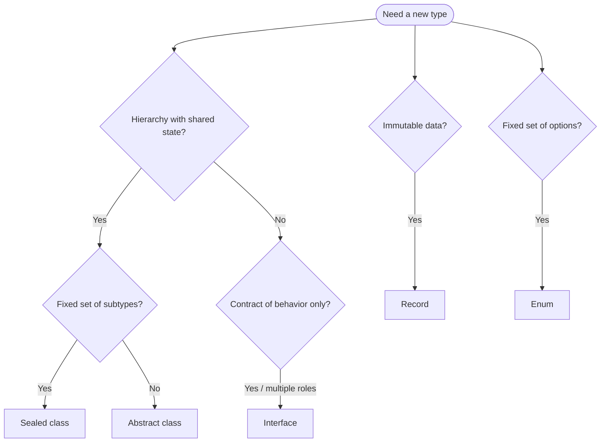

# Объектно‑ориентированное проектирование в Java: классы, интерфейсы и другие конструкции

В этом документе кратко изложены основные понятия объектно‑ориентированного программирования (ООП), используемые в курсе, и показано, как конструкции Java (класс, абстрактный класс, интерфейс, sealed‑класс, record, enum и др.) применяются в реальных системах   например, в **платёжной системе** или в **системе уведомлений**.

---

## 1. Основные понятия ООП

В классической литературе по ООП обычно выделяют три принципа (инкапсуляция, наследование, полиморфизм). Ниже   соответствие между этими принципами и механизмами их реализации в Java.




### 1.1 Инкапсуляция

**Инкапсуляция**   объединение данных и операций над ними в одной единице (классе) и контроль доступа к внутреннему состоянию. На практике это достигается **сокрытием информации** (information hiding): внутренние данные объявляют `private`, доступ   только через методы.

- Поля обычно объявляют с модификатором `private`.
- Доступ к данным обеспечивается через методы: геттеры и сеттеры (например, `getOwner()`, `setOwner()`), а для денежного баланса — через предметные методы (`deposit()`, `withdraw()`), а не прямой `setBalance(...)`.
- Модификаторы доступа (`private`, доступ в пределах пакета (package-private), `protected`, `public`) задают, **кто может видеть** и **кто может изменять** внутреннее состояние объекта.

Пример (упрощённый банковский счёт):

```java
public class BankAccount {
    private String owner;
    private double balance;

    public BankAccount(String owner, double initialBalance) {
        this.owner = owner;
        this.balance = initialBalance;
    }

    public String getOwner() {
        return owner;
    }

    public void setOwner(String owner) {
        if (owner == null || owner.isBlank()) {
            System.out.println("Ошибка: владелец не может быть пустым");
            return;
        }
        this.owner = owner;
    }
}
```

Важно:

- К полям `owner` и `balance` нельзя обратиться напрямую извне класса.
- Имя владельца читается и изменяется через публичные методы `getOwner()` и `setOwner(...)`. Баланс в реальной системе должен изменяться через предметные методы (`deposit()`, `withdraw()`), которые инкапсулируют бизнес-правила.

*Схема доступа (для поля `owner`):* внешний код не обращается к полю напрямую; чтение и запись идут только через публичные методы.




---

### 1.2 Наследование

**Наследование** позволяет одному классу использовать и дополнять другой класс.

```java
public abstract class Animal {
    public abstract void makeSound();

    public void sleep() {
        System.out.println("Zzzz...");
    }
}

public class Dog extends Animal {
    @Override
    public void makeSound() {
        System.out.println("Woof!");
    }
}
```

- Класс `Dog` **является** разновидностью `Animal` (отношение «является»).
- Наследование используют для таких иерархий, где подклассы имеют общее состояние и поведение, но уточняют отдельные части.

Иерархия из примера (наследование: подкласс расширяет суперкласс):



---

### 1.3 Полиморфизм

**Полиморфизм** (в контексте наследования)   возможность одной переменной ссылочного типа указывать на объекты разных конкретных типов. Вызов метода определяется **реальным** типом объекта в момент выполнения (**динамическое связывание**, dynamic dispatch), а не объявленным типом переменной.

```java
Animal a1 = new Dog();
Animal a2 = new Cat();

a1.makeSound(); // Woof!
a2.makeSound(); // Meow!
```

Так можно писать **общий код** (например, метод, принимающий `Animal`), который ведёт себя по‑разному для каждого конкретного подтипа.

*Схема полиморфизма:* тип переменной   супертип (`Animal`), тип объекта в памяти   подтип (`Dog`/`Cat`). Вызов `makeSound()` привязан к **реальному** типу объекта (динамическое связывание).



---

## 2. Конструкции типов в Java: обзор

В Java есть несколько видов конструкций для моделирования разных задач проектирования.

| Конструкция | Основная идея |
|-------------|----------------|
| **Класс** | Обычный «чертёж» объекта |
| **Абстрактный класс** | Базовый класс с общим состоянием и логикой; его нельзя инстанцировать (создавать экземпляры только через подклассы) |
| **Интерфейс** | Контракт поведения («что умеет делать») |
| **Sealed‑класс / интерфейс** | Ограниченная иерархия наследования |
| **Record** | Компактный неизменяемый носитель данных |
| **Enum** | Фиксированный набор именованных констант |
| **Статический вложенный класс** | Вспомогательный класс внутри другого класса |
| **Локальный / анонимный класс** | Тип, существующий только внутри метода |

Ниже   **когда какую конструкцию выбирать**. Стрелки отражают типичный выбор по задаче, а не иерархию наследования типов.



Ниже даны краткие пояснения и примеры.

---

## 3. Обычный класс

Обычный класс хранит **состояние** (поля) и задаёт **поведение** (методы):

```java
public class SmartDevice {
    private String modelName;          // поле экземпляра
    public static int deviceCount = 0; // статическое поле, общее для всех

    { deviceCount++; }                 // блок инициализации экземпляра

    public SmartDevice(String modelName) {
        this.modelName = modelName;
    }

    public String getModelName() {
        return modelName;
    }
}
```

Кратко:

- Классы используют, когда нужны **изменяемые объекты с поведением**.
- В сочетании с инкапсуляцией они помогают сохранять инварианты (правила допустимого состояния объекта).

---

## 4. Абстрактный класс

Абстрактный класс:

- может содержать абстрактные методы (без тела) и обычные методы;
- **нельзя инстанцировать** напрямую (`new Employee(...)` запрещён), только через конкретные подклассы.

Модификатор **`protected`** в абстрактном классе корректен и часто используется: экземпляры создаются у **подклассов** (Manager, Developer, Intern), а `protected` даёт им доступ к полям и методам базового класса, не открывая их внешнему коду.

```java
public abstract class Employee {
    protected String name;
    protected double baseSalary;

    public abstract double calculateBonus();

    public double totalCompensation() {
        return baseSalary + calculateBonus();
    }
}
```

Абстрактный класс уместен, когда:

- несколько подклассов разделяют **общее состояние** и часть поведения;
- нужен **базовый тип** с частичной реализацией.

Пример иерархии сотрудников (как в Практике 2). Абстрактный метод помечен `*`; подклассы дают конкретную реализацию.



---

## 5. Интерфейс

Интерфейс описывает **что** объект умеет делать, а не **как** это реализовано.

```java
public interface Trainable {
    void train(); // по умолчанию абстрактный

    // Метод с реализацией по умолчанию (с Java 8)
    default void praise() {
        System.out.println("Good job!");
    }

    static String getLevel() {        // статический вспомогательный метод
        return "BASIC";
    }
}
```

Особенности:

- У интерфейса нет состояния экземпляра (только константы).
- Класс может реализовать **несколько** интерфейсов (`implements`), но наследовать только **один** класс (`extends`).
- Интерфейсы удобны для описания **возможностей**, общих для разных, не связанных наследством классов.

---

## 6. Sealed‑класс и sealed‑интерфейс

Sealed‑типы (Java 17+) ограничивают круг классов, которые могут наследовать или реализовывать данный тип:

```java
public sealed class Shape permits Circle, Square { }

public final class Circle extends Shape { /* ... */ }
public final class Square extends Shape { /* ... */ }
```

Плюсы:

- Все возможные подтипы известны на этапе компиляции.
- Это повышает **безопасность** и позволяет компилятору проверять полноту `switch` (предупреждение, если пропущен вариант).

Иерархия sealed: только перечисленные в `permits` классы могут расширять `Shape`.



---

## 7. Запись (record)

**Record** (запись, Java 16+)   компактный тип для **неизменяемых** данных; неявно наследует `java.lang.Record`.

```java
public record User(String name, int age) {
    public User {
        if (age < 0) {
            throw new IllegalArgumentException("Age cannot be negative");
        }
    }
}
```

Компилятор автоматически создаёт:

- конструктор;
- методы доступа (`name()`, `age()`);
- `equals`, `hashCode`, `toString`.

Record используют, когда:

- нужны **объекты-значения** (value objects): равенство и идентичность определяются содержимым полей, а не ссылкой;
- нужно минимизировать служебный код (конструктор, геттеры, `equals`/`hashCode`/`toString` генерируются компилятором).

---

## 8. Перечисление (enum)

**Enum** (перечисление) задаёт **фиксированный набор** именованных констант и является ссылочным типом:

```java
public enum Direction {
    NORTH, SOUTH, EAST, WEST;

    public boolean isVertical() {
        return this == NORTH || this == SOUTH;
    }
}
```

Плюсы:

- Типобезопасная замена «магических» строк или чисел.
- У констант могут быть поля, методы и даже реализация интерфейсов.
- Удобно использовать с `EnumSet` и `EnumMap` для эффективных коллекций.

---

## 9. Функциональные интерфейсы, лямбды и ссылки на методы

**Функциональный интерфейс** (Java 8+)   интерфейс с ровно одним абстрактным методом экземпляра; остальные методы могут быть `default` или `static` (например, `Predicate<T>`, `Consumer<T>`).

Примеры:

```java
Predicate<String> isLong = s -> s.length() > 10;   // лямбда-выражение
Consumer<String> printer = System.out::println;     // ссылка на метод
```

Преимущества:

- Код короче, чем с анонимными классами.
- Лямбды и ссылки на методы   основа Stream API и современного стиля Java.

---

## 10. Локальные и анонимные классы

**Локальный класс** объявляется внутри метода и виден только в его области видимости. **Анонимный класс**   безымянный подкласс или реализация интерфейса, создаваемая «на месте». Оба приёма используют для кода, не нужного вне данного контекста.

```java
public void process() {
    class Validator {               // локальный класс
        void check() {
            // логика проверки
        }
    }

    Runnable r = new Runnable() {   // анонимный класс
        @Override
        public void run() {
            System.out.println("Running...");
        }
    };
}
```

Во многих случаях анонимные классы для интерфейсов с одним методом заменяют лямбдами.

---

## 11. Зачем интерфейсы нужны в платёжной и уведомительной системах

### 11.1 Платёжная система

Реальная платёжная система может поддерживать:

- **банковские карты**,
- **банковские переводы**,
- **электронные кошельки**,
- позже   **мобильные платежи**, **новых провайдеров** и т.д.

Для всех способов оплаты нужно:

- провести платёж,
- посчитать комиссию,
- сформировать описание или чек.

Это удобно описать интерфейсом. Один контракт   несколько реализаций (полиморфизм по интерфейсу).



```java
public interface PaymentMethod {
    String process(double amount);
    double fee(double amount);
}
```

Конкретные реализации:

```java
public final class CreditCardPayment implements PaymentMethod {
    @Override
    public String process(double amount) {
        return "Оплата картой: " + amount + " руб.";
    }

    @Override
    public double fee(double amount) {
        return amount * 0.02;
    }
}

public final class BankTransferPayment implements PaymentMethod {
    @Override
    public String process(double amount) {
        return "Перевод через банк: " + amount + " руб.";
    }

    @Override
    public double fee(double amount) {
        return 50.0;
    }
}
```

Код верхнего уровня:

```java
public void pay(PaymentMethod method, double amount) {
    System.out.println(method.process(amount));
    System.out.println("Комиссия: " + method.fee(amount));
}
```

**Польза интерфейса здесь:**

1. **Расширяемость**  
   Чтобы добавить новый способ оплаты (например, `CryptoWalletPayment`), достаточно реализовать интерфейс `PaymentMethod`. Код, который вызывает `pay(PaymentMethod, amount)`, менять не нужно.

2. **Полиморфизм и простой API**  
   Бизнес-логика зависит только от возможности вызвать `process` и `fee`, а не от деталей протоколов банков или HTTP.

3. **Тестирование и подмена (mock)**  
   В тестах можно подставить простую реализацию `PaymentMethod`, которая не обращается к реальным банкам. Тесты становятся быстрыми и безопасными.

4. **Разделение ответственности**  
   Бизнес-слой знает **что** должно произойти (списать деньги с пользователя). Конкретные классы знают **как** общаться с тем или иным провайдером.

---

### 11.2 Система уведомлений

Система уведомлений может поддерживать:

- электронную почту,
- SMS,
- push-уведомления,
- сообщения внутри приложения.

Общее поведение задаётся интерфейсом; каналы доставки   разные реализации.



```java
public interface Notifier {
    void send(String recipient, String message);
}
```

Реализации:

```java
public final class EmailNotifier implements Notifier {
    @Override
    public void send(String recipient, String message) {
        // логика отправки письма
    }
}

public final class SmsNotifier implements Notifier {
    @Override
    public void send(String recipient, String message) {
        // логика отправки SMS
    }
}
```

Использование:

```java
public void notifyUser(Notifier notifier, String user, String text) {
    notifier.send(user, text);
}
```

**Польза:**

1. **Один API, много каналов**  
   Бизнес-код работает с типом `Notifier`, а не с деталями SMTP или SMS-шлюзов.

2. **Легко добавить новый канал**  
   Можно ввести `PushNotifier` позже, не меняя существующую логику.

3. **Настройка во время выполнения**  
   Реализацию можно выбирать в runtime (настройки пользователя, окружение), сохраняя один и тот же интерфейс для остальной системы.

---

## 12. Практические рекомендации по проектированию

Упрощённая схема выбора конструкции. Если ни один критерий не подходит, используется обычный класс.



При проектировании кода:

1. **Классы и абстрактные классы**   для иерархий с общим состоянием и поведением (`Employee`, `Shape`).
2. **Интерфейсы**   для описания возможностей:  
   `PaymentMethod`, `Notifier`, `Trainable`, `Serializable`, `Comparable`.
3. **Sealed-типы**   когда набор подтипов фиксирован и нужно, чтобы компилятор это проверял.
4. **Record**   для неизменяемых данных, идентичность которых определяется содержимым.
5. **Enum**   для фиксированного набора вариантов (статусы, направления, роли); при необходимости   вместе с `EnumSet` и `EnumMap`.
6. **Предпочитать неизменяемость** там, где это возможно; изменяемые типы (`StringBuilder`, изменяемые коллекции)   только когда нужна производительность.

Такие подходы дают код, который:

- **ясно структурирован** (структура соответствует предметной области),
- **безопасен** (инкапсуляция, контролируемые иерархии),
- **удобен для поддержки и развития**

и соответствует научно и академически корректному стилю разработки на Java.
