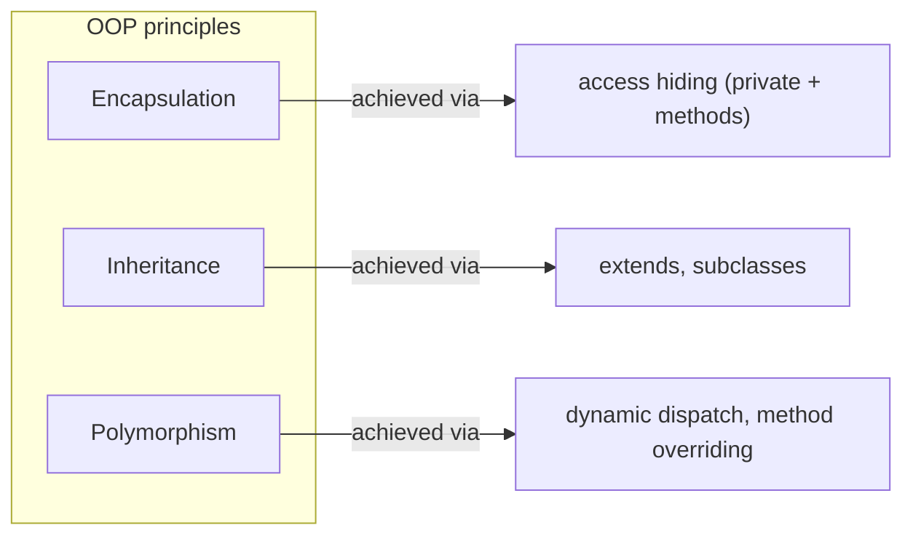
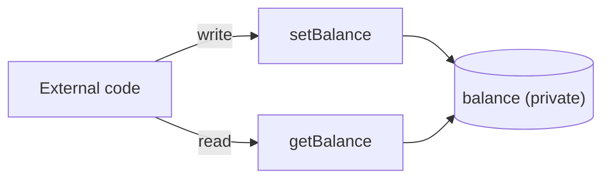
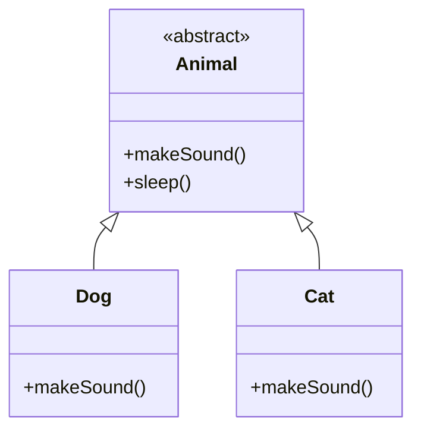
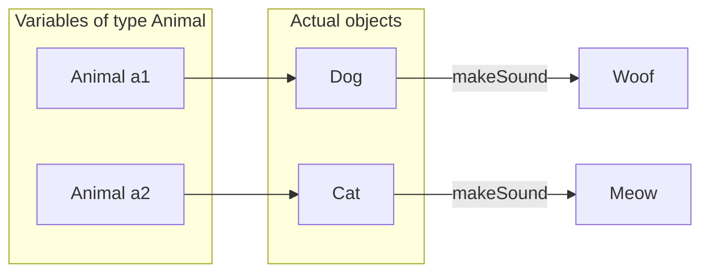
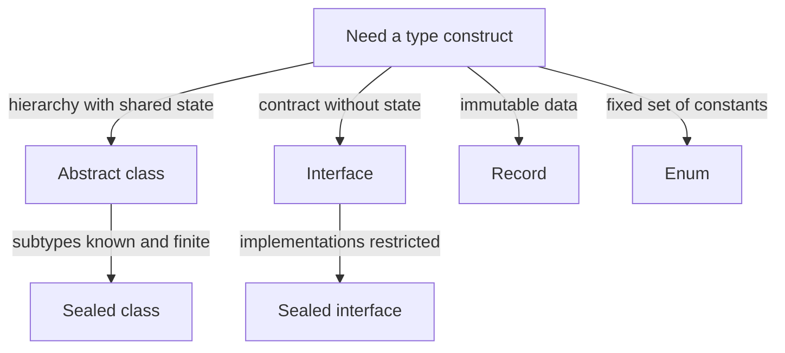
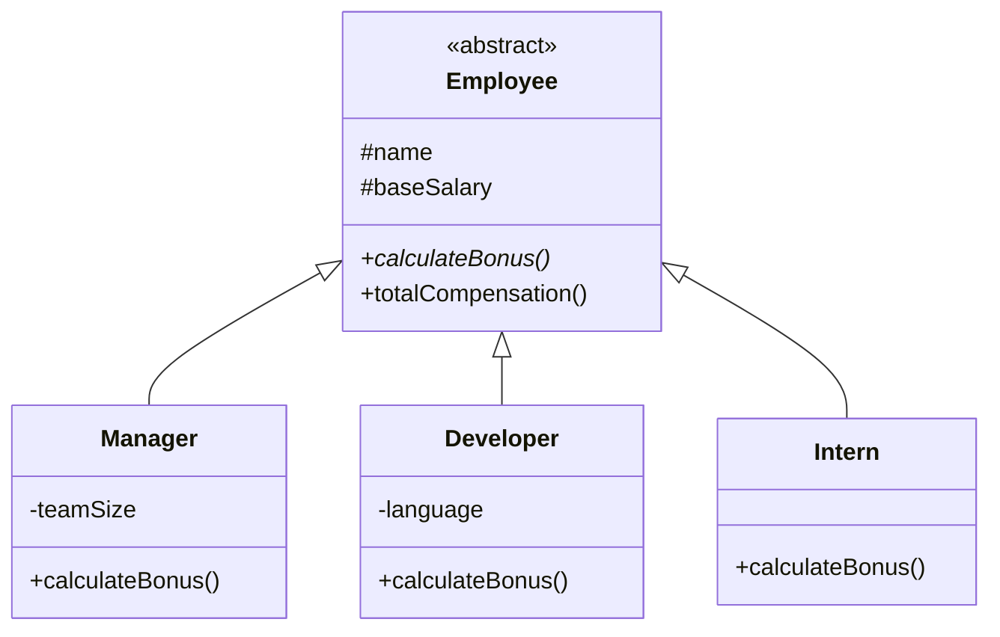
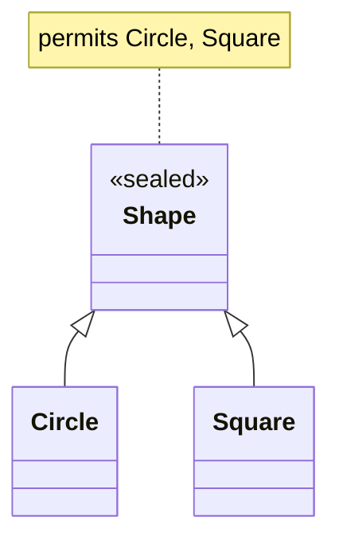
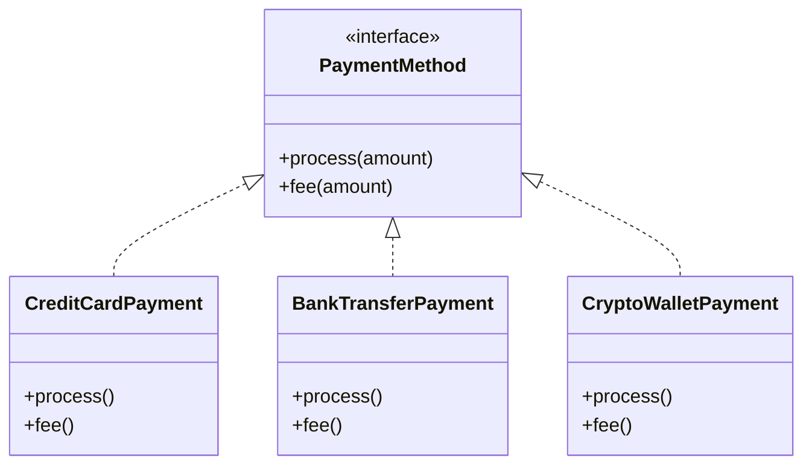
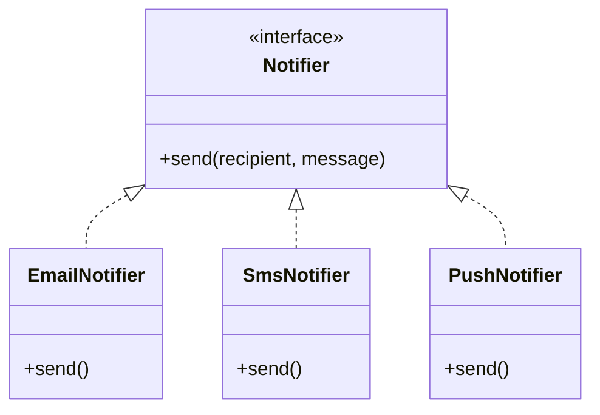
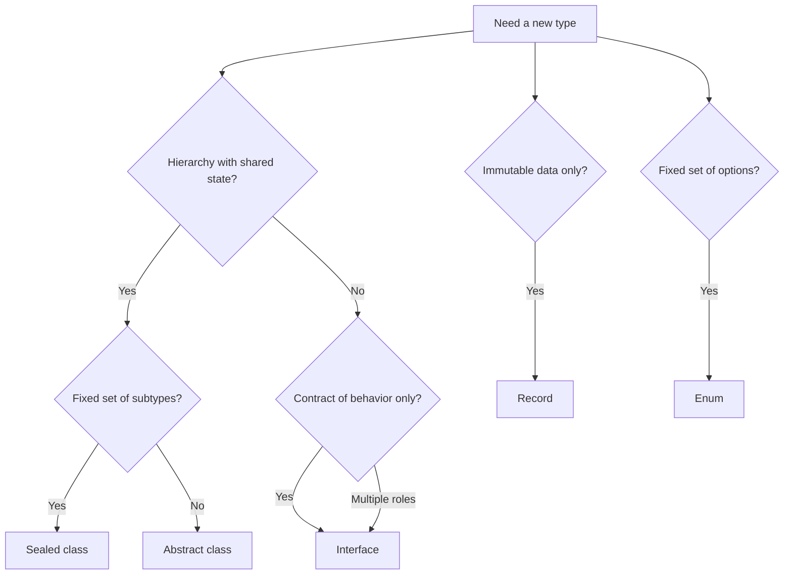

## Object‑Oriented Design in Java: Classes, Interfaces, and More

This document summarizes the key object‑oriented concepts used in the course and explains how different Java type constructs (class, abstract class, interface, sealed class, record, enum, etc.) work together in real systems like **payment processing** or **notification delivery**.

---

## 1. Core OOP Concepts

In classical OOP literature, three principles are commonly emphasized: encapsulation, inheritance, and polymorphism. The diagram below shows the mechanisms through which they are realized in Java:



### 1.1 Encapsulation

**Encapsulation** is the bundling of data and operations on that data into a single unit (a class) and the control of access to internal state. In practice this is achieved by **information hiding**: internal data are declared `private`, and access is only through methods.

- Fields are usually marked `private`.
- Access is provided through methods (getters and setters, e.g. `getBalance()`, `setBalance()`).
- Access modifiers (`private`, package‑private, `protected`, `public`) control **who can see** and **who can modify** the internal state.

Example (simplified bank account):

```java
public class BankAccount {
    private String owner;
    private double balance;

    public BankAccount(String owner, double initialBalance) {
        this.owner = owner;
        this.balance = initialBalance;
    }

    public double getBalance() {
        return balance;
    }

    public void setBalance(double balance) {
        if (balance < 0) {
            System.out.println("Error: balance cannot be negative");
            return;
        }
        this.balance = balance;
    }
}
```

Here:

- `balance` is not directly accessible from outside.
- Reading is through the public getter `getBalance()`, writing through the public setter `setBalance(...)`, which can enforce validation.

Data access only through methods (information hiding):



---

### 1.2 Inheritance

**Inheritance** allows a class to reuse and extend another class:

```java
public abstract class Animal {
    public abstract void makeSound();

    public void sleep() {
        System.out.println("Zzzz...");
    }
}

public class Dog extends Animal {
    @Override
    public void makeSound() {
        System.out.println("Woof!");
    }
}
```

- `Dog` **is‑a** `Animal`.
- Inheritance is used for **“is‑a” relationships** where subclasses share common state and behavior but specialize some parts.

Hierarchy from the example:



---

### 1.3 Polymorphism

**Polymorphism** (in the context of inheritance) means that a single reference type can refer to objects of different concrete types. Which method runs is determined by the **actual** type of the object at runtime (**dynamic dispatch**), not by the declared type of the variable.

```java
Animal a1 = new Dog();
Animal a2 = new Cat();

a1.makeSound(); // Woof!
a2.makeSound(); // Meow!
```

This allows writing **generic code** (e.g. methods that accept `Animal`) which behaves differently for each concrete subtype.

Polymorphism: variables of a declared type refer to objects of concrete subtypes; the method invoked is bound to the object’s type (dynamic dispatch).



---

## 2. Java Type Constructs: Overview

Java offers several constructs to model different design needs.

| Type                 | Main idea                                      |
|----------------------|-----------------------------------------------|
| **Class**            | Standard blueprint for objects                |
| **Abstract class**   | Base class with shared state/logic, cannot be instantiated directly |
| **Interface**        | Contract of behavior (“can do something”)     |
| **Sealed class/interface** | Restricted inheritance hierarchy         |
| **Record**           | Compact, immutable data carrier               |
| **Enum**             | Fixed set of named constants                  |
| **Static nested class** | Helper class inside another class          |
| **Local / anonymous class** | Short‑lived type inside a method       |

The diagram below shows **when to choose which construct** (arrows denote typical design choice, not type inheritance):



Below are short explanations and examples.

---

## 3. Standard Class

A standard class stores **state** and defines **behavior**:

```java
public class SmartDevice {
    private String modelName;          // instance field
    public static int deviceCount = 0; // static field, shared

    { deviceCount++; }                 // instance initializer

    public SmartDevice(String modelName) {
        this.modelName = modelName;
    }

    public String getModelName() {
        return modelName;
    }
}
```

Key points:

- Use classes when you need **mutable objects with behavior**.
- Combine with encapsulation to protect invariants (rules about valid object state).

---

## 4. Abstract Class

An abstract class:

- may contain abstract methods (no body) and concrete methods,
- **cannot be instantiated** directly (`new Employee(...)` is invalid); only concrete subclasses are instantiated.

Using **`protected`** in an abstract class is correct and common: instances are created from **subclasses** (Manager, Developer, Intern), and `protected` gives them access to the base class’s fields and methods without exposing them to unrelated code.

```java
public abstract class Employee {
    protected String name;
    protected double baseSalary;

    public Employee(String name, double baseSalary) {
        this.name = name;
        this.baseSalary = baseSalary;
    }

    public abstract double calculateBonus();

    public double totalCompensation() {
        return baseSalary + calculateBonus();
    }
}
```

Use an abstract class when:

- several subclasses share **state** and part of behavior,
- you want a **base type** with partial implementation.

Example employee hierarchy (as in Practice 2):



---

## 5. Interface

An interface describes **what** an object can do, not **how** it does it.

```java
public interface Trainable {
    void train(); // abstract by default

    // Default implementation (since Java 8)
    default void praise() {
        System.out.println("Good job!");
    }

    static String getLevel() {        // static utility
        return "BASIC";
    }
}
```

Characteristics:

- No instance state (only constants).
- A class can `implements` many interfaces, but `extends` at most one class.
- Great for modeling **capabilities** that apply to different, unrelated classes.

---

## 6. Sealed Class / Sealed Interface

Sealed types (Java 17+) restrict who can extend/implement them:

```java
public sealed class Shape permits Circle, Square { }

public final class Circle extends Shape { /* ... */ }
public final class Square extends Shape { /* ... */ }
```

Benefits:

- You know **all possible subtypes** at compile time.
- Useful for **safety** and for exhaustive `switch` statements:
  the compiler can warn if you forgot a case.

Sealed hierarchy (only permitted subclasses):



---

## 7. Record

A record (Java 16+) is a **compact, immutable** data carrier (it implicitly extends `java.lang.Record`).

```java
public record User(String name, int age) {
    public User {
        if (age < 0) {
            throw new IllegalArgumentException("Age cannot be negative");
        }
    }
}
```

Compiler generates:

- canonical constructor,
- accessors (`name()`, `age()`),
- `equals`, `hashCode`, `toString`.

Use records when:

- you need **value objects** (data with identity by content),
- you want to avoid boilerplate.

---

## 8. Enum

Enums represent a **fixed set of named constants** and are reference types:

```java
public enum Direction {
    NORTH, SOUTH, EAST, WEST;

    public boolean isVertical() {
        return this == NORTH || this == SOUTH;
    }
}
```

Benefits:

- Type‑safe alternative to “magic strings” or integers.
- Can have fields, methods, and even implement interfaces.
- Work very well with `EnumSet` and `EnumMap` for efficient collections.

---

## 9. Functional Interfaces, Lambdas, and Method References

A **functional interface** (Java 8+) has exactly one abstract instance method; other methods may be `default` or `static` (e.g. `Predicate<T>`, `Consumer<T>`).

Examples:

```java
Predicate<String> isLong = s -> s.length() > 10;   // lambda expression
Consumer<String> printer = System.out::println;    // method reference
```

Advantages:

- More concise than anonymous classes.
- Central to the Stream API and modern Java style.

---

## 10. Local and Anonymous Classes

Used for short‑lived behaviors bound to a method:

```java
public void process() {
    class Validator {               // local class
        void check() {
            // validation logic
        }
    }

    Runnable r = new Runnable() {   // anonymous class
        @Override
        public void run() {
            System.out.println("Running...");
        }
    };
}
```

In many cases, anonymous classes for single‑method interfaces are now replaced by lambdas.

---

## 11. Why Interfaces Are Powerful in Payment and Notification Systems

### 11.1 Payment System

A realistic payment system may support:

- **credit cards**,  
- **bank transfers**,  
- **electronic wallets**,  
- later: **mobile payments**, **new providers**, etc.

All payment methods need to:

- process a payment,
- compute a fee,
- produce some description/receipt.

You can model this with an interface. One interface, many payment methods:



```java
public interface PaymentMethod {
    String process(double amount);
    double fee(double amount);
}
```

Concrete implementations:

```java
public final class CreditCardPayment implements PaymentMethod {
    @Override
    public String process(double amount) {
        return "Оплата картой: " + amount + " руб.";
    }

    @Override
    public double fee(double amount) {
        return amount * 0.02;
    }
}

public final class BankTransferPayment implements PaymentMethod {
    @Override
    public String process(double amount) {
        return "Перевод через банк: " + amount + " руб.";
    }

    @Override
    public double fee(double amount) {
        return 50.0;
    }
}
```

High‑level code:

```java
public void pay(PaymentMethod method, double amount) {
    System.out.println(method.process(amount));
    System.out.println("Комиссия: " + method.fee(amount));
}
```

**Benefits of using an interface here:**

1. **Extensibility**  
   - To add a new payment method (e.g. `CryptoWalletPayment`), you just implement `PaymentMethod`.
   - Existing code that uses `pay(PaymentMethod, amount)` does not change.

2. **Polymorphism and clean APIs**  
   - Business code depends only on the ability to `process` and compute `fee`, not on low‑level HTTP calls, bank protocols, etc.

3. **Testing and mocking**  
   - You can provide a simple test implementation of `PaymentMethod` that does not talk to real banks, which makes unit tests fast and safe.

4. **Separation of concerns**  
   - The business layer knows **what** should happen (charge a user).  
   - Concrete implementations know **how** to talk to each provider.

---

### 11.2 Notification System

A notification system may support:

- Email,
- SMS,
- Push notifications,
- In‑app messages.

Common behavior. One contract, multiple delivery channels:



```java
public interface Notifier {
    void send(String recipient, String message);
}
```

Implementations:

```java
public final class EmailNotifier implements Notifier {
    @Override
    public void send(String recipient, String message) {
        // логика отправки письма
    }
}

public final class SmsNotifier implements Notifier {
    @Override
    public void send(String recipient, String message) {
        // логика отправки SMS
    }
}
```

High‑level usage:

```java
public void notifyUser(Notifier notifier, String user, String text) {
    notifier.send(user, text);
}
```

**Benefits:**

1. **One API, many channels**  
   - Business code works with `Notifier`, not with SMTP or SMS gateways.

2. **Easy to add new channels**  
   - Add `PushNotifier` later without changing existing logic.

3. **Runtime configuration**  
   - Choose implementation at runtime (user preferences, environment), while keeping the same interface for the rest of the system.

---

## 12. Practical Design Guidelines

Simplified decision guide (a plain class is the default when none of the following special needs apply):



When designing your own code:

1. **Use classes / abstract classes** for hierarchies with shared state and behavior (`Employee`, `Shape`).
2. **Use interfaces** for capabilities:
   - `PaymentMethod`, `Notifier`, `Trainable`, `Serializable`, `Comparable`.
3. **Use sealed types** when the set of subtypes is fixed and you want the compiler to help enforce this.
4. **Use records** for immutable, value‑like data where identity is defined by content.
5. **Use enums** for fixed sets of options (statuses, directions, roles) and combine with `EnumSet` / `EnumMap` where appropriate.
6. **Prefer immutability** where it makes sense; use mutable types (`StringBuilder`, mutable collections) only when needed for performance.

These patterns lead to code that is:

- **clearly structured** (structure matches the domain),
- **safe** (encapsulation, controlled hierarchies),
- **maintainable and extensible**,

in line with sound, academically grounded Java design practice.

